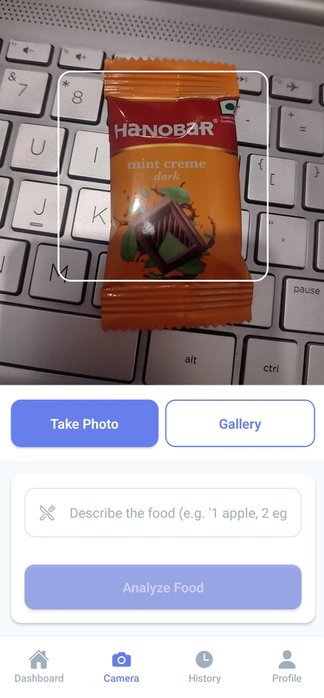

# CalTrack — Smart Nutrition Tracker

AI-powered meal logging with automatic nutrition analysis. Snap a photo of your food and instantly get detailed nutritional information.

## 📱 Screenshots

<div align="center">
  
  
  
  
</div>

<div align="center">
  
  
</div>

## 🍎 Key Features

### 📸 Smart Meal Detection
- **Camera Integration**: Snap photos of your meals for easy logging
- **AI Food Recognition**: Automatically identify foods from photos
- **Manual Entry**: Add meals manually with detailed nutrition search

### 📊 Nutrition Tracking
- **Calorie Counting**: Track daily caloric intake with visual progress
- **Macro Breakdown**: Monitor protein, carbs, and fat distribution
- **Daily Overview**: See today's nutrition summary at a glance
- **Progress Charts**: Visual representation of your nutrition goals

### 🗂️ Meal Management
- **Meal History**: Browse all logged meals with timestamps
- **Detailed Logging**: Record specific portion sizes and nutrition details
- **Food Database**: Access comprehensive nutrition information via Nutritionix API
- **Quick Logging**: Save frequently eaten foods for faster entry

### 👤 Personal Tracking
- **Daily Goals**: Set and track personalized nutrition targets
- **Progress Monitoring**: Visual charts showing your nutrition trends
- **Meal Patterns**: Understand your eating habits over time

## Download

📱 **Android APK**: [Download CalTrack APK](https://your-eas-build-url-here.apk)

> Note: Enable "Install unknown apps" in Android settings if prompted.

## 🚀 Getting Started

1. **Download & Install** the app
2. **Create Account** with email and password
3. **Set Your Goals** (daily calorie and macro targets)
4. **Start Logging Meals**:
   - Use camera to snap food photos
   - Search and add foods manually
   - View automatic nutrition calculations
5. **Track Progress** on your dashboard

## 🛠️ For Developers

### Tech Stack
- **Frontend**: React Native with Expo Router
- **Authentication**: Supabase Auth
- **Database**: PostgreSQL (Supabase)
- **Nutrition Data**: Nutritionix API
- **AI Recognition**: Clarifai API
- **Camera**: Expo Camera

### Local Development

1. Clone the repository
```bash
git clone https://github.com/your-username/caltrack.git
cd caltrack
```

2. Install dependencies
```bash
npm install
```

3. Set up environment variables
```bash
# Copy the example file
copy .env.example .env

# Add your API keys:
EXPO_PUBLIC_SUPABASE_URL=your_supabase_url
EXPO_PUBLIC_SUPABASE_ANON_KEY=your_supabase_key
EXPO_PUBLIC_NUTRITIONIX_APP_ID=your_nutritionix_app_id
EXPO_PUBLIC_NUTRITIONIX_API_KEY=your_nutritionix_api_key
EXPO_PUBLIC_CLARIFAI_API_KEY=your_clarifai_key
```

4. Start development server
```bash
npx expo start
```

### Required APIs

**Nutritionix API** (Food Database)
- Sign up at [nutritionix.com](https://nutritionix.com)
- Get App ID and API Key for nutrition data

**Clarifai API** (Food Recognition)
- Sign up at [clarifai.com](https://clarifai.com)
- Get API Key for food image recognition

**Supabase** (Backend)
- Create project at [supabase.com](https://supabase.com)
- Set up authentication and database tables

### Database Schema

```sql
-- User profiles
CREATE TABLE profiles (
  id UUID REFERENCES auth.users(id) PRIMARY KEY,
  display_name TEXT,
  daily_calorie_goal INTEGER DEFAULT 2000,
  daily_protein_goal INTEGER DEFAULT 150,
  daily_carbs_goal INTEGER DEFAULT 250,
  daily_fat_goal INTEGER DEFAULT 65,
  created_at TIMESTAMPTZ DEFAULT NOW()
);

-- Meal logs
CREATE TABLE meal_logs (
  id UUID PRIMARY KEY DEFAULT gen_random_uuid(),
  user_id UUID NOT NULL REFERENCES auth.users(id),
  food_name TEXT NOT NULL,
  calories INTEGER DEFAULT 0,
  protein NUMERIC DEFAULT 0,
  carbs NUMERIC DEFAULT 0,
  fat NUMERIC DEFAULT 0,
  serving_size TEXT,
  meal_type TEXT, -- breakfast, lunch, dinner, snack
  photo_url TEXT,
  logged_at TIMESTAMPTZ DEFAULT NOW()
);
```

## 🎯 How It Works

1. **Photo Capture**: Use your phone's camera to take a picture of your meal
2. **AI Analysis**: Clarifai API analyzes the image to identify food items
3. **Nutrition Lookup**: Nutritionix API provides detailed nutrition information
4. **Smart Logging**: App calculates calories, protein, carbs, and fat
5. **Progress Tracking**: Dashboard shows daily progress toward your goals
6. **History Review**: All meals saved with photos and nutrition details

## 📱 App Features Breakdown

### Dashboard Screen
- Today's calorie progress (circular chart)
- Macro breakdown (protein/carbs/fat)
- Recent meals list
- Quick action buttons

### Camera Screen
- Real-time camera view
- Photo capture for meal logging
- AI-powered food recognition
- Manual food search fallback

### History Screen
- Chronological list of all meals
- Filter by date range
- Nutrition details per meal
- Photo thumbnails

### Profile Screen
- User account information
- Daily nutrition goal settings
- App preferences
- Sign out option

## 🔒 Privacy & Data

- All nutrition data stored securely
- Photos stored locally and optionally in cloud
- No data sharing with third parties
- User authentication required

## 🤝 Contributing

1. Fork the repository
2. Create a feature branch
3. Make your changes
4. Submit a pull request

## 📄 License

This project is licensed under the MIT License - see the LICENSE file for details.

## 🆘 Support

Having issues? Check our troubleshooting guide or create an issue on GitHub.

---

**Start tracking your nutrition smarter with CalTrack!** 🥗📊
